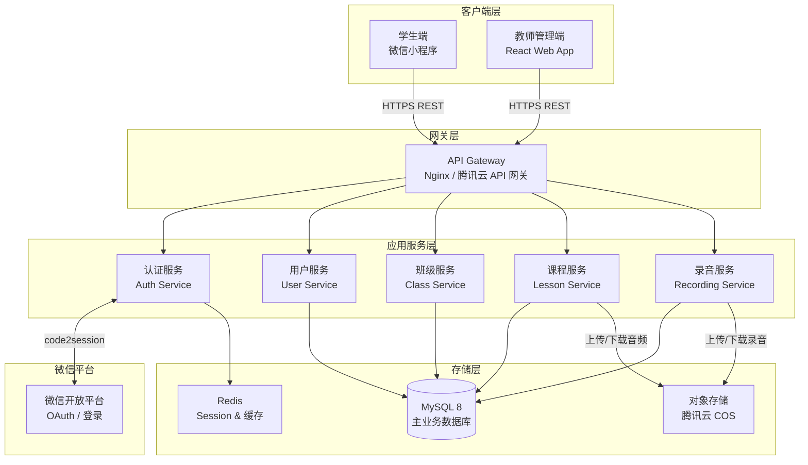
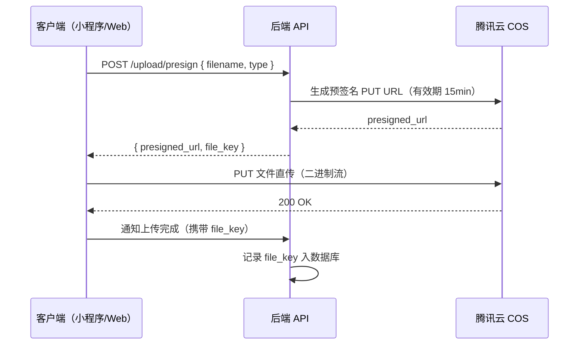
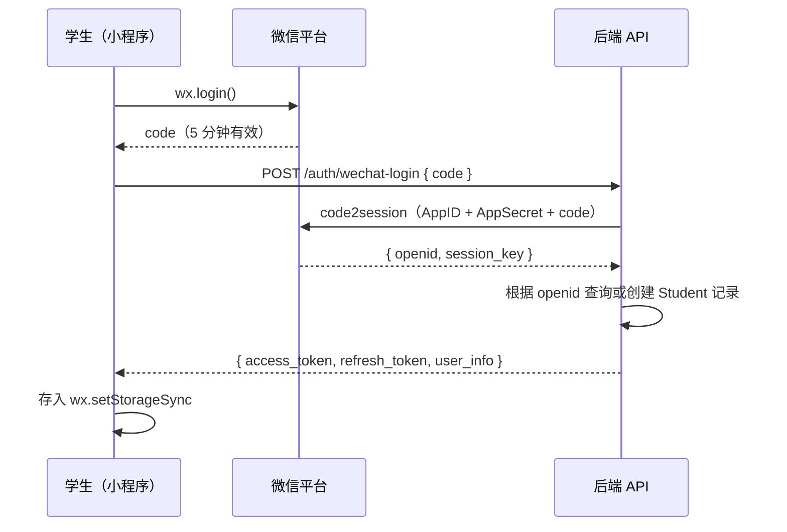

# 儿童英语跟读系统 — 整体架构设计

> 项目代号：**rebalance.report**  
> 设计日期：2026-04-25  
> 版本：v1.2

---

## 1. 系统概览

本系统服务于儿童英语课后跟读场景，由三个核心前端/终端和一套后端服务组成：

| 端 | 类型 | 用户 |
|---|---|---|
| 学生端 | 微信小程序（Mini Program） | 儿童学生 |
| 教师管理端 | Web 网页应用（SPA） | 英语老师 |
| 服务器 | RESTful API + 文件存储 | 系统内部 |

---

## 2. 系统架构图



---

## 3. 技术栈选型

### 3.1 学生端 — 微信小程序

| 层次 | 技术 | 理由 |
|------|------|------|
| 框架 | **原生微信小程序** (WXML/WXSS/JS) | 最佳兼容性，符合腾讯审核要求，无框架依赖包体积 |
| 状态管理 | `app.globalData` + 页面 `data` | 轻量级，避免引入 MobX 增加包体积 |
| 网络层 | 封装 `wx.request` 的统一请求工具 | 统一处理 Token、错误、重试 |
| 音频录制 | `wx.getRecorderManager()` | 微信原生，支持 MP3/AAC 格式 |
| 音频播放 | `wx.createInnerAudioContext()` | 适合逐句播放场景 |
| 存储 | `wx.setStorageSync` / `wx.getStorageSync` | 本地缓存 Token 和用户信息 |

> **关键约束**：主包 < 2MB；所有网络请求域名须在微信管理后台白名单注册；强制 HTTPS。

### 3.2 教师管理端 — Web SPA

| 层次 | 技术 | 理由 |
|------|------|------|
| 框架 | **React 18 + TypeScript** | 生态完善，组件化好，易于维护 |
| UI 组件库 | **Ant Design 5** | 中文友好，管理后台场景完备 |
| 路由 | React Router v6 | 标准 SPA 路由方案 |
| 状态管理 | **Zustand** | 轻量，无 Redux 样板代码 |
| 构建工具 | **Vite** | 极速 HMR，生产构建快 |
| HTTP 请求 | **Axios** | 拦截器机制便于统一鉴权 |
| 文件上传 | 腾讯云 COS JS SDK 直传 | 大文件直传到 COS，不经过应用服务器 |

### 3.3 后端服务

| 层次 | 技术 | 理由 |
|------|------|------|
| 运行时 | **Node.js 20 LTS** | JS 全栈统一语言，异步 I/O 适合音频流场景 |
| Web 框架 | **Express.js** + TypeScript | 轻量，生产成熟，扩展灵活 |
| ORM | **Prisma** | 类型安全，自动 migration，与 TypeScript 深度集成 |
| 数据库 | **MySQL 8.0**（腾讯云 TDSQL-C） | 关系型数据一致性强；兼容微信官方示例 |
| 缓存 | **Redis 7**（腾讯云 TCRDB） | Session 存储、速率限制、临时 Token |
| 文件存储 | **腾讯云 COS** | 国内 CDN 加速，与小程序同生态，审计合规 |
| 认证 | **JWT** (Access Token 2h + Refresh Token 7d) | 无状态，适合小程序和 SPA 双端 |
| API 风格 | **RESTful** | 简单直观，前端对接成本低 |

### 3.4 部署与运维

| 组件 | 技术 | 说明 |
|------|------|------|
| 小程序托管 | 微信开发者工具 → 微信后台发布 | 标准流程 |
| Server 托管 | **腾讯云 CVM** 或 **云托管（CloudBase）** | CloudBase 可零配置部署 Node.js，推荐初期使用 |
| 反向代理 | **Nginx** | SSL 终止、静态资源托管、API 转发 |
| Web 前端 | **腾讯云 COS + CDN** 静态托管 | 低成本、高可用 |
| CI/CD | **GitHub Actions** | 自动测试 + 部署 |
| 监控 | 腾讯云 **云监控 + 日志服务（CLS）** | 告警、日志检索 |

---

## 4. 领域模型

```mermaid
erDiagram
    Teacher {
        string id PK
        string username
        string password_hash
        string name
        datetime created_at
    }
    Class {
        string id PK
        string teacher_id FK
        string name
        string description
        datetime created_at
    }
    Student {
        string id PK
        string openid UK "微信 openid"
        string student_code UK "绑定码"
        string name
        int login_streak
        datetime created_at
    }
    Lesson {
        string id PK
        string title
        string image_url "儿童画 COS URL"
        string master_audio_url
        datetime created_at
    }
    LessonScore {
        string id PK
        string student_id FK
        string lesson_id FK
        int score_percent
        string trophy_level
    }
    Sentence {
        string id PK
        string lesson_id FK
        string text
        string audio_url "教师录音 COS URL"
        int    order_index
    }
    RecordingSubmission {
        string id PK
        string student_id FK
        string lesson_id FK
        string sentence_id FK
        string audio_url "学生录音 COS URL"
        string status "pending|reviewed"
        datetime submitted_at
    }

    Teacher ||--o{ Class : "管理"
    Teacher ||--o{ Lesson : "创建(课程库)"
    Class }o--o{ Student : "加入(多对多)"
    Class }o--o{ Lesson : "分配(多对多)"
    Lesson ||--o{ Sentence : "包含"
    Student ||--o{ RecordingSubmission : "提交"
    Sentence ||--o{ RecordingSubmission : "对应"
    Student ||--o{ LessonScore : "获得"
    Lesson ||--o{ LessonScore : "记录"
```

---

## 5. API 设计概览

所有接口前缀：`/api/v1`

### 5.1 认证接口

| 方法 | 路径 | 描述 | 调用方 |
|------|------|------|--------|
| POST | `/auth/wechat-login` | 微信小程序一键登录（code → JWT） | 学生端 |
| POST | `/auth/teacher-login` | 账号密码登录 | 教师端 |
| POST | `/auth/refresh` | 刷新 Access Token | 双端 |

### 5.2 班级与学生接口

| 方法 | 路径 | 描述 |
|------|------|------|
| GET | `/classes` | 获取教师所有班级 |
| POST | `/classes` | 创建班级 |
| GET | `/classes/:id/students` | 获取班级学生列表 |
| POST | `/students` | 创建学生 |
| PUT | `/students/:id` | 修改学生信息（含班级分配） |
| DELETE | `/students/:id` | 删除学生 |

### 5.3 课程接口

| 方法 | 路径 | 描述 |
|------|------|------|
| GET | `/lessons?class_id=` | 获取班级课程列表（学生端） |
| POST | `/lessons` | 创建课程（教师端） |
| GET | `/lessons/:id` | 获取课程详情（含句子和音频 URL） |
| POST | `/lessons/:id/sentences` | 添加句子（含参考音频上传） |

### 5.4 录音接口

| 方法 | 路径 | 描述 |
|------|------|------|
| POST | `/recordings` | 学生提交录音（含 COS 上传 URL 生成） |
| GET | `/recordings?student_id=&lesson_id=` | 教师查看录音列表 |
| GET | `/recordings/:id/url` | 获取录音播放 URL |

---

## 6. 文件上传流程（COS 预签名 URL）



> 优点：大文件不经过应用服务器，节省带宽，降低延迟。

---

## 7. 微信登录流程



---

## 8. 架构决策记录 (ADR)

### ADR-001：原生小程序 vs Taro/uni-app

**状态**: 已接受

**背景**: 是否使用跨平台框架。

**决策**: 使用原生小程序开发。

**原因**:
- 本项目只需支持微信，无跨平台需求
- 原生包体积更小（主包限制 2MB）
- 无框架编译中间层，调试更直接
- 腾讯官方原生 API 无延迟兼容问题

**权衡**: 不可复用于支付宝/抖音小程序；但当前阶段不需要。

---

### ADR-002：云托管 CloudBase vs 自建 CVM

**状态**: 已接受（初期阶段）

**背景**: 服务器部署方式选择。

**决策**: 初期使用腾讯云 CloudBase（云托管），待流量增长后迁移 CVM+Kubernetes。

**原因**:
- CloudBase 零配置支持 Node.js，部署时间极短
- 域名、HTTPS 证书、自动扩缩容均已内置
- 与小程序同一生态，域名白名单配置更方便
- 初期用户量小，Serverless 费用最低

---

### ADR-003：音频格式标准

**状态**: 已接受

**决策**: 学生录音使用 **AAC** 格式（`wx.getRecorderManager` 默认），教师上传参考音频接受 **MP3/AAC/WAV**，服务端统一转换存储为 AAC。

**原因**:
- 微信小程序 RecorderManager 默认输出 AAC
- AAC 压缩率高，适合移动端播放
- 后端转码保证格式统一性（可选：使用 FFmpeg）

---

### ADR-004：数据库选型 MySQL vs MongoDB

**状态**: 已接受

**决策**: 使用 MySQL 8（关系型）。

**原因**:
- 数据结构高度关系化（班级 → 学生 → 课程 → 句子）
- Prisma ORM 与 MySQL 支持成熟
- 腾讯云 TDSQL-C（兼容 MySQL）提供高可用和自动备份
- MongoDB 对此场景无明显优势

---

## 9. 安全要求

| 安全点 | 实现方式 |
|--------|----------|
| 传输加密 | 强制 HTTPS，TLS 1.2+ |
| 认证 | JWT，密钥 HS256，Access Token 2h 过期 |
| 权限控制 | RBAC：Teacher 角色 vs Student 角色 |
| 密码存储 | bcrypt（rounds=12） |
| 微信 session_key | 仅服务端持有，不下发客户端 |
| COS 访问 | 学生上传用预签名 URL，读取按需生成临时 URL |
| 频率限制 | 登录接口 5次/分钟/IP |
| 敏感数据 | 遵守《个人信息保护法（PIPL）》，minimizing 数据收集 |
| 内容安全 | 学生录音上传前后可接入微信 `msgSecCheck` |
