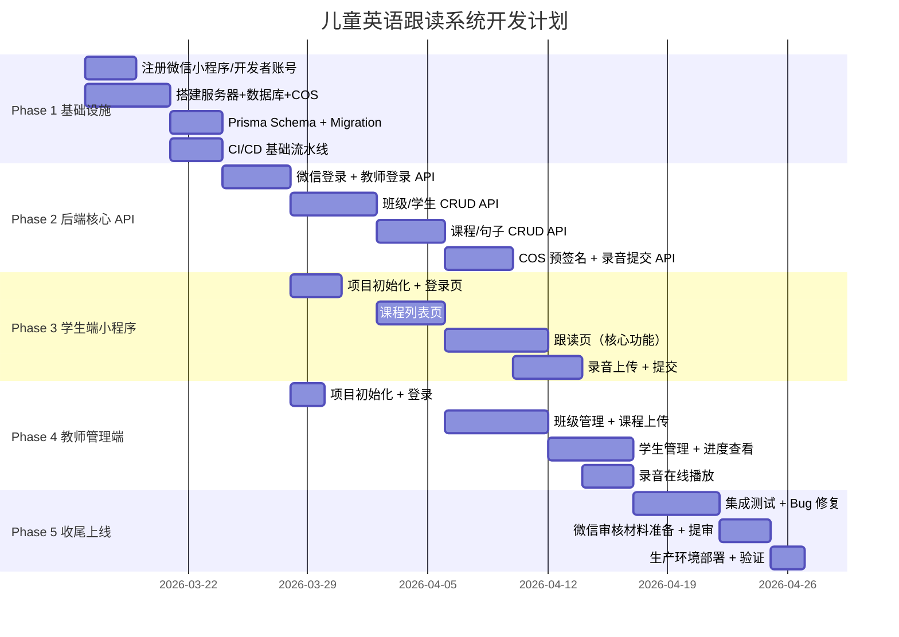

# 儿童英语跟读系统 — 项目推进计划

> 版本：v1.0 | 日期：2026-03-14  
> 预估总工期（1 名全栈开发者）：约 **10 周**

---

## 优先级原则

本项目的核心价值链路为：
> **学生能跟读并提交录音 → 教师能查看录音**

因此优先级编排遵循：**让核心价值链路尽早跑通**，其次添加管理功能，最后打磨体验。

---

## 里程碑总览

---

## Phase 1 — 基础设施搭建（第 1 周）

**目标**: 开发环境就绪，基础服务可运行

### 任务清单

| 优先级 | 任务 | 说明 |
|--------|------|------|
| P0 | 注册微信小程序账号（个人/企业），获取 AppID | 决定后续开发能否开始的前提 |
| P0 | 申请腾讯云账号，开通 CloudBase/CVM、COS、TDSQL-C | 基础设施 |
| P0 | 配置 COS Bucket（权限策略、CORS） | 文件上传必需 |
| P0 | 初始化 Node.js + Express + Prisma 项目 | 后端骨架 |
| P0 | 执行 Prisma Migration，建表 | 数据库就绪 |
| P1 | 配置 GitHub 仓库 + 基础 CI（lint + type-check） | 代码质量保障 |
| P1 | 配置 Nginx + HTTPS | 必须：小程序要求所有接口 HTTPS |

**里程碑验收**: `POST /api/v1/health` 返回 200，数据库表已创建，COS 可正常上传文件

---

## Phase 2 — 后端核心 API（第 2–3 周）

**目标**: 核心业务 API 全部就绪，Postman 可调通

### 任务清单

| 优先级 | 任务 | 说明 |
|--------|------|------|
| P0 | 微信 `code2session` 登录 API | 学生端最高优先 |
| P0 | 教师账号密码登录 API | 教师端基础 |
| P0 | JWT 中间件（鉴权 + 角色控制） | 安全前提 |
| P0 | 班级/学生 CRUD API | 教师管理核心 |
| P0 | 学生码绑定 API（学生首次登录输入学生码） | 注册流程关键 |
| P0 | 课程/句子 CRUD API | 内容管理核心 |
| P0 | COS 预签名 URL 生成 API | 文件上传核心 |
| P0 | 录音提交 API | 学生提交核心 |
| P1 | 录音播放临时 URL API | 教师查看录音 |
| P1 | Dashboard 统计 API | 教师概览 |
| P2 | Rate Limiting（登录接口） | 安全加固 |

**里程碑验收**: Postman Collection 覆盖所有接口，全部调通

---

## Phase 3 — 学生端微信小程序（第 3–5 周）

**目标**: 学生可从登录到提交录音完整跑通

### 任务清单

| 优先级 | 任务 | 说明 |
|--------|------|------|
| P0 | 小程序项目初始化（`project.config.json`，AppID 配置） | 先决条件 |
| P0 | 封装 `utils/request.js`（统一 HTTPS 请求 + Token 注入） | 所有请求基础 |
| P0 | 登录页（`wx.login()` → code → JWT 存储） | 入口 |
| P0 | 课程列表页（卡片 UI，`scroll-view` 滑动） | 核心展示 |
| P0 | 跟读页 — 句子滚动显示逻辑 | 核心交互 |
| P0 | 跟读页 — `RecorderManager` 按住录音 / 松开停止 | 最核心录音功能 |
| P0 | 录音本地暂存（各句覆盖式存储） | 用户体验 |
| P0 | 结束并发送：预签名 URL → `wx.uploadFile` → 提交 | 完整价值链路 |
| P1 | 参考音频播放（"听范读"按钮） | 教学功能 |
| P1 | 麦克风权限引导 UI | 合规 + 体验 |
| P1 | 提交成功动画页 | 正向激励 |
| P2 | 录音加载骨架屏 | 体验优化 |
| P2 | 离线提示（无网络时友好提示） | 鲁棒性 |

**里程碑验收**: 真机（iOS + Android）上完整跑通"登录 → 看课程 → 跟读 → 提交"

> ⚠️ **关键风险**: 微信 `RecorderManager` 在部分 iOS 设备上存在兼容性问题，需真机充分测试。

---

## Phase 4 — 教师管理端 Web（第 4–7 周）

**目标**: 教师可管理班级、上传课程、查看学生录音

### 任务清单

| 优先级 | 任务 | 说明 |
|--------|------|------|
| P0 | React + Vite 项目初始化，Ant Design 配置 | 先决条件 |
| P0 | 登录页 + Axios 拦截器（Token 注入） | 入口 |
| P0 | 班级管理页（列表、创建、删除） | 基础管理 |
| P0 | 课程管理页（课程列表、创建课程表单） | 内容管理 |
| P0 | 句子管理（文本输入 + 音频上传 + 排序） | 课程上传核心 |
| P0 | COS 直传集成（进度条） | 文件上传 |
| P0 | 学生管理页（列表、创建、班级分配） | 学生管理 |
| P0 | 学生详情 + 录音播放 | 查看录音核心 |
| P1 | 学生进度可视化（进度条） | 教学反馈 |
| P1 | Dashboard 首页概览 | 快速了解状态 |
| P2 | 录音标记已听（状态更新） | 工作流优化 |
| P2 | 响应式布局（平板兼容） | 体验 |

**里程碑验收**:
- 教师上传一堂课后，学生小程序可见该课程并完成跟读提交
- 教师在管理端可播放学生提交的录音

---

## Phase 5 — 收尾与上线（第 9–10 周）

**目标**: 系统稳定上线，通过微信审核

### 任务清单

| 优先级 | 任务 | 说明 |
|--------|------|------|
| P0 | 全链路集成测试（真实教师账号 + 真实学生测试） | 最终验证 |
| P0 | 性能测试（模拟 50 学生并发提交录音） | 稳定性 |
| P0 | 微信小程序隐私政策页面（必须，否则审核被拒） | 合规强制要求 |
| P0 | 补全小程序 `app.json` 权限描述 | 审核要求 |
| P0 | 提交微信审核 | 上线关键路径 |
| P0 | 生产环境数据库备份验证 | 数据安全 |
| P1 | 错误监控接入（腾讯云 CLS + 告警） | 运维 |
| P1 | 教师端部署到 COS 静态托管 + CDN | 正式上线 |
| P2 | 录音文件自动清理策略（> 180天的 pending 录音） | 存储成本控制 |

---

## 风险与应对

| 风险 | 影响 | 应对方案 |
|------|------|----------|
| 微信审核被拒 | 延误 1–2 周 | 提前阅读《小程序审核规范》，隐私政策和权限说明务必完整 |
| 录音兼容性问题（iOS 低版本） | 核心功能受损 | Phase 3 结束前在 iOS 真机充分测试，预留 1 周 bug 修复时间 |
| 教师上传大音频文件（>50MB） | 上传超时/失败 | 在教师端强制限制单个音频 < 10MB，UI 提示压缩建议 |
| 微信 openid 与学生绑定 | 注册流程复杂 | 学生码方案已在需求文档中设计，需充分测试 |
| 腾讯云 CloudBase 冷启动延迟 | 首次请求慢 | 设置最小实例数 = 1（少量费用，避免冷启动） |

---

## 开发人力参考

| 角色 | 工作量 | 备注 |
|------|--------|------|
| 全栈开发（后端 + 小程序） | 主力开发 | Phase 1-3 |
| 前端开发（Web 管理端） | 4–5 周 | Phase 4 起可并行 |
| 测试 | 1 周 | Phase 5 |

> 如果是**单人全栈**，建议总工期预留 12 周。
